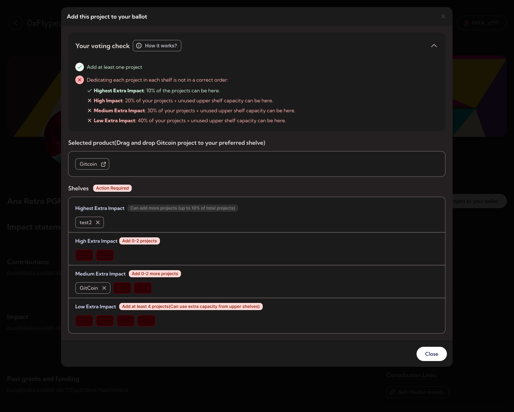

# Voting

Once applications has been approved and the voters' addresses have been added, your voters can now vote for projects.

    

- Navigate to [https://impact.pokt.network/projects](https://impact.pokt.network/projects)
- Click the "Add this project to your ballot" button in the project details page or navigate directly to [Ballot page](https://impact.pokt.network/ballot)
- Adjust the allocation
- Click Submit ballot and sign the message
